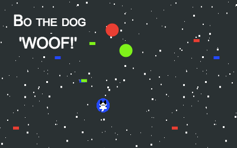

# BO THE DOG

A 13kb javascript game for fun and learning.

### Bos story
Bo the dog fell into the RGB screen.
Can you help Bo to find his way back into the offline world?

### How to play
Download the code and just open the index.html on your Desktop.  

**Start game** with "enter"  
**Navigate** Bo with the "arrow keys"   
**Pause** game with "p"

Collect the "RGB-dots" to change Bo's color.  
Collect the "RGB-pixel" items in Bo's color to increase your score.

**WON** (Bo can go offline): Score => 100  
**GAME OVER** (Bo has to stay in the screen): Score =< -50

### Compatibility
Desktop: Chrome, Safari, Firefox

### Libs
Kontra.js  
https://straker.github.io/kontra/

### 13kb Game Challenge
Main theme for the 2018 competition is "offline".
All code and game assets need to be smaller than 13,312 bytes.  
https://js13kgames.com/

### Author
Asisa Asseily  
https://github.com/asisaa

**Contribution**
Idea session, debugging support and development of the background. Timo Schuhmacher - https://github.com/tschuhmacher

### My Story
Some people dream of writing there own book, or starting there own blog,
I always wanted to develop my own game. This vacation I decided to make my dream come true.
In the beginning I was not sure where to start, which language to learn or
how to make sound or a simple game loop.
Then I heard about the 13kb challenge. The challenge had already started
but I decided to start anyway. And this was the best decision ever! Read more in my [postmortem](postmortem.md)

**Enjoy playing "Bo the Dog"!**

### License
This project is licensed under the MIT License - see the LICENSE.txt file for details

### Acknowledgment

**THANK YOU**
- Andrzej Mazur for running the competition
- Pablo Farias Navarro for the amazing kontra tutorial
- Mattia Fortunati for inspiration and the well documented code
- Greg Hovanesyan for the great article "Introduction to Web Audio API"  
https://css-tricks.com/introduction-web-audio-api/
