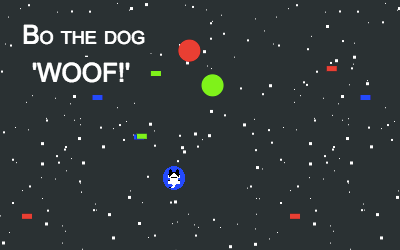

# Sometimes it get's woof - But you have to be even woofer!

## How I started
It was during my vacation end of August, when I heard about the js13kGame challenge. I love to travel, but this vacation I decided to develop my first game.

To get started I packed my stuff and went to my favorite library. It is not just a beautiful public space, it also has this really good and  nice coffee bar.

I started brainstorming game ideas and at the same time learning how to code a javascript game.
I was reading through the GitHub tips and tricks, where I found the amazing tutorial from Pablo Farias Navarro.

When I started to share my game ideas with my family and friends, from that point on, I felt like the challenge is really on.

## My 5 take aways     

#### 1. 13k
Like probably everyone on this challenge I needed to learn how to be very careful with my kilobyte. I used https://www.minifier.org/ to minify my js and my html code. However I never manage to get advzip to work. At the end I had to remove three pngs and instead created simple shapes with kontra.js.

#### 2. Sound matters
I was really excited to learn the web audio API. That was quite a ride! From creating my first sound to integrating sound to my game. Probably one of the hardest challenges. I was super happy when I found the blogpost from Greg Hovanesyan: "Introduction to Web Audio API" https://css-tricks.com/introduction-web-audio-api/

#### 3. Try again
At the end, I was definitely getting a bit low on time. There wasn't any time to integrate features like a 'try again'-button or a nicer start and end experience. But while you're on the challenge there's always more to improve.

#### 4. More levels     
With what I learned, now I feel ready to add more levels to my game or bring "Bo the dog" to his next adventure.

#### 5. Do it!
What ever you dream of doing in your live, even if you are a totally beginner, do it! I had so much fun developing this game and I feel full of energy for more.
